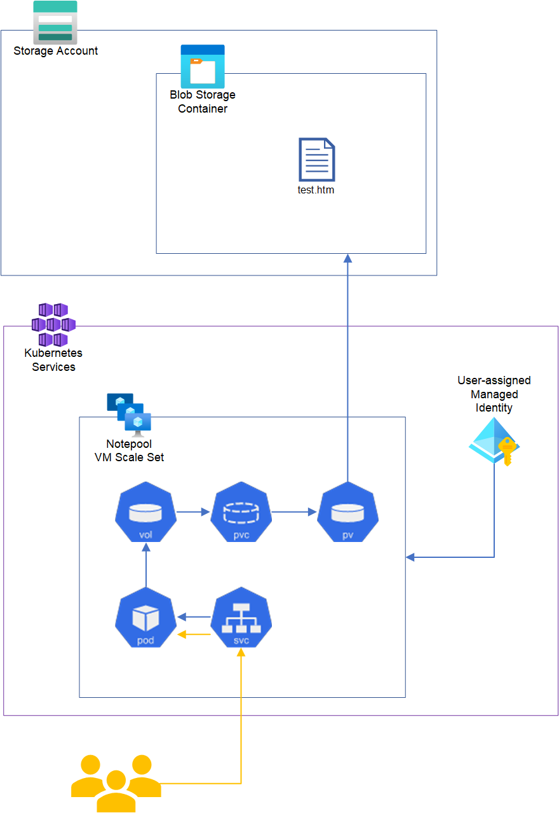

# Mount an azure blob storage with a dedicated user-assigned managed indentity



## Before you begin

- The Azure CLI version 2.37.0 or later. Run `az --version` to find the version, and run `az upgrade` to upgrade the version. If you need to install or upgrade, see [Install Azure CLI][install-azure-cli].

- Install the aks-preview Azure CLI extension version 0.5.85 or later.

- Ensure, that you are authenticated or run `az login` 

- Run `az account set --subscription "mysubscription"` to select the right subscription


## Install the Azure CLI aks-preview extension

The following steps are required to install and register the Azure CLI aks-preview extension and driver in your subscription.

1. To use the Azure CLI aks-preview extension for enabling the Blob storage CSI driver (preview) on your AKS cluster, run the following command to install it:

    ```azurecli
    az extension add --name aks-preview
    ```

2. Run the following command to register the CSI driver (preview):
    
    ```azurecli
    az feature register --name EnableBlobCSIDriver --namespace Microsoft.ContainerService 
    ```

3. To register the provider, run the following command:

    ```azurecli
    az provider register -n Microsoft.ContainerService
    ```

When newer versions of the extension are released, run the following command to upgrade the extension to the latest release:

```azurecli
az extension update --name aks-preview
```

## Automated installation
You can either go for the automated installation or do it all manually. This is the automated installation.
1. Run the setup
    ```powershell
    # run setup
    .\setup.ps1 -resourcegroup "aks-fuseblob-mi" -storageaccountname "myaksblob" -aksname "aks-fuseblob-mi"
    ```

1. Go to the url, that the script shows you


## Manual installation instructions
You can either go for the automated installation or do it all manually. This is the manual installation instruction.

1. Create resource group
    ```bash
    resourcegroup="aks-fuseblob-mi"
    az group create -l eastus -n "$resourcegroup"
    ```

1. Create storage account container and upload file
    ```bash
    storageaccountname="myaksblob"
    az storage account create -g "$resourcegroup" -n "$storageaccountname" --access-tier Hot  --sku Standard_LRS
    az storage container create -n mycontainer --account-name "$storageaccountname" --public-access off
    az storage blob upload \
        --account-name myaksblob \
        --container-name mycontainer \
        --name test.htm \
        --file test.htm \
        --auth-mode key --account-key "$(az storage account keys list --account-name "$storageaccountname" --query '[0].value' -o tsv)"
    ```

1. Create user-assigned managed identity and give access to storage account
    ```bash
    az identity create -n myaksblobmi -g "$resourcegroup"
    miioid="$(az identity list -g "$resourcegroup" --query "[?name == 'myaksblobmi'].principalId" -o tsv)"
    said="$(az storage account list -g "$resourcegroup" --query "[?name == '$storageaccountname'].id" -o tsv)"
    az role assignment create --assignee-object-id "$miioid" --role "Storage Blob Data Owner" --scope "$said"
    ```

1. Create AKS cluster
    ```bash
    aksname="aks-fuseblob-mi"
    az aks create \
        -g "$resourcegroup" \
        -n "$aksname" \
        --enable-managed-identity \
        --enable-blob-driver \
        --node-count 1 \
        --generate-ssh-keys
    ```

1. Assign the user-assigned managed identity to the AKS vm scale set
    ```bash
    aksnprg="$(az aks list -g "$resourcegroup" --query "[?name == '$aksname'].nodeResourceGroup" -o tsv)"
    aksnp="$(az vmss list -g "$aksnprg" --query "[?starts_with(name, 'aks-nodepool1-')].name" -o tsv)"
    miid="$(az identity list -g "$resourcegroup" --query "[?name == 'myaksblobmi'].id" -o tsv)"
    az vmss identity assign -g "$aksnprg" -n "$aksnp" --identities "$miid"
    ```

1. Get the objectID of your user-assigned managed identity
    ```bash
    az identity list -g -g "$resourcegroup" --query "[?name == 'myaksblobmi'].principalId" -o tsv
    ```

1. Create a ``volume.yaml`` file and set objectID for ``AzureStorageIdentityObjectID``. \
   Please also check ``resourceGroup`` and ``storageAccount``.
    ```yml
    apiVersion: v1
    kind: PersistentVolume
    metadata:
      name: pv-blob1
    spec:
      capacity:
        storage: 10Gi
      accessModes:
        - ReadWriteMany
      persistentVolumeReclaimPolicy: Retain  # If set as "Delete" container would be removed after pvc deletion
      storageClassName: azureblob-fuse-premium
      mountOptions:
        - -o allow_other
        - --file-cache-timeout-in-seconds=120
      csi:
        driver: blob.csi.azure.com
        readOnly: false
        # make sure this volumeid is unique in the cluster
        # `#` is not allowed in self defined volumeHandle
        volumeHandle: pv-blob1
        volumeAttributes:
          protocol: fuse
          resourceGroup: aks-fuseblob-mi
          storageAccount: myaksblob
          containerName: mycontainer
          AzureStorageAuthType: MSI
          AzureStorageIdentityObjectID: "xxxxx-xxxx-xxx-xxx-xxxxxxx"
    
    ---
    
    apiVersion: v1
    kind: PersistentVolumeClaim
    metadata:
      name: pvc-blob1
    spec:
      accessModes:
        - ReadWriteMany
      resources:
        requests:
          storage: 10Gi
      volumeName: pv-blob1
      storageClassName: azureblob-fuse-premium
    ```

1. Create a ``deployment.yaml`` file.
    ```yml
    apiVersion: apps/v1
    kind: Deployment
    metadata:
      labels:
        app: nginx-app1
      name: nginx-app1
    spec:
      replicas: 1
      selector:
        matchLabels:
          app: nginx-app1
      template:
        metadata:
          labels:
            app: nginx-app1
        spec:
          containers:
          - image: mcr.microsoft.com/oss/nginx/nginx:1.19.5
            name: webapp
            imagePullPolicy: Always
            resources: {}
            ports:
              - containerPort: 80
            volumeMounts:
              - name: pvc-blob1
                mountPath: /usr/share/nginx/html
          volumes: 
            - name: pvc-blob1 
              persistentVolumeClaim: 
                claimName:  pvc-blob1
    status: {}
    
    ---
    
    apiVersion: v1
    kind: Service
    metadata:
      name: nginx-app1
      labels:
        run: nginx-app1
    spec:
      ports:
      - port: 80
        protocol: TCP
      selector:
        app: nginx-app1
      type: LoadBalancer
    ```

1. Get AKS credentials
    ```bash
    az aks get-credentials --admin -g "$resourcegroup" -n "$aksname"
    ```

1. Apply the yaml files
    ```bash
    # create pv and pvc
    kubectl.exe apply -f .\volumes.yaml
    # check it
    kubectl.exe get pv -A
    kubectl.exe get pvc -A

    # create deployment and service
    kubectl.exe apply -f .\deployment.yaml
    # check it
    kubectl.exe get pods -A
    ```

1. Get the url, that you want to open in the browser
    ```bash
    echo "Please surf to: http://$(kubectl.exe get service --field-selector  metadata.name==nginx-app1 -o 'jsonpath={.items[*].status.loadBalancer.ingress[*].ip}')/test.htm"
    ```


[install-azure-cli]: https://docs.microsoft.com/en-us/cli/azure/install-azure-cli
